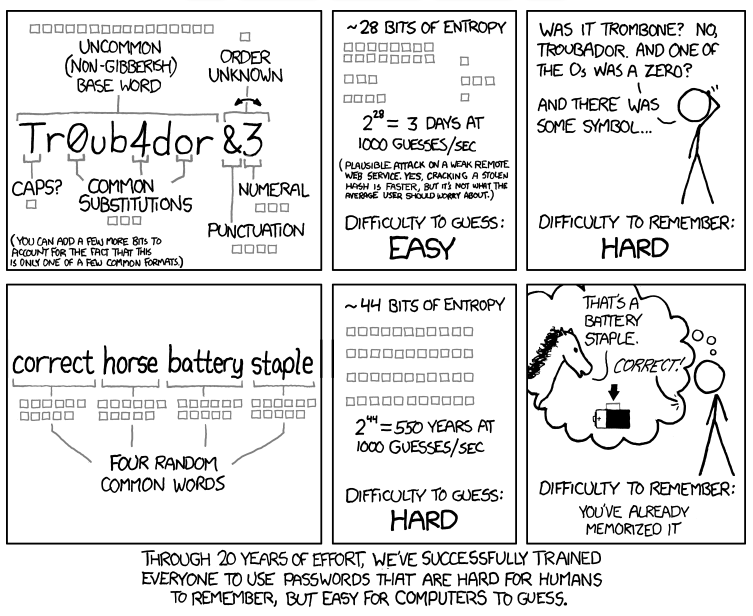

# password-generator
a python script to generate a random password. inspired by the following xkcd comic:

# instructions
to run the password generator, simply run py main.py to get a default password of four words.
to see more complex combinations, use py main.py -h.

